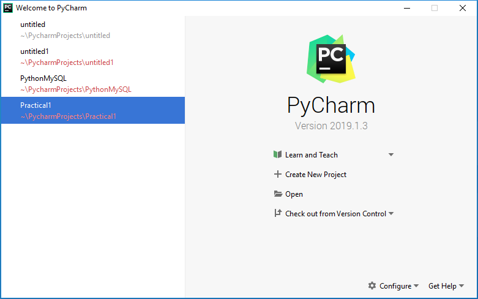

# Case Study 1


In this case study, we will introduce to all of the key concepts,
ideas and tools behind a modern software engineering *project*.

To do this, we will write a piece of software in Python, which will
build, run, test and version. These are the critical processes for all
software development, and as a result we will see most of the key tools
that you need for modern software development.

This project starts off relatively mechanically -- you start at the
beginning and follow the instructions. But there is also lots of
explanatory material; please take the time to go through this as well
as follow some of the links and look up more background information.

## What is a Project?

There are many different meanings to *software project*, which have
changed over time, as have the tools and best practices. At its
simplest, though, it is a collection of files that taken together will
produce a computational *artefact* that does something useful for
someone.

In some languages, even for a trivial piece of functionality, this
requires a number of files. At first sight, though, for Python this
seems a bit unnecessary. The simplest is a single source file:

```{.python include=python/hello_world.py}
```

which when run will print "Hello World", like so:

```{include=python/hello_world.out}
```

Let's do this in the simplest of ways with the minimal of tools and
files, and probably in a way that you have not done before.

 - Click on the Windows Menu
 - Type some of "Command Prompt" till you get a unique completion

You may or may not have used a "Command Prompt" before. If you have
not, in the first case, this will be a slightly strange experience,
but it is one of the most powerful ways of interacting with a
computer.

You should see a window, with a black background and the following
text:

```
Microsoft Windows [Version 10.0.14393]
(c) 2016 Microsoft Corporation. All rights reserved.

H:\
```

The `H:\` part is a prompt which means that you can type a
command. Type `copy CON hello_world.py`, then "Return", the text
`print("Hello World")`, then "return" again and finally press `Ctrl-C` (the
control key and C key simultaneously).

It should look like this:


```
H:\>copy CON hello_world.py
print("Hello World")
        1 file(s) copied.
```

What you have done is placed a file onto your `H:\` drive with the
contents `print("Hello World")`. We can now run this directly using
`python`, as follows:

```
H:\>python hello_world.py
Hello World
```

And there we have it. A single file, that does something useful (in
the sense that it is useful for telling you that it works), and that
is a complete computational artefact.

## Key Tool 1: An IDE

We could, of course, write all of our code using something akin to
`copy CON hello_world.py`. It is clearly not a way forward,
however. So, we need an Editor. To spoil the suspense, we are going to
end up with choosing PyCharm. This choice has significant implications
for what we mean by a project, as you will see shortly.

There are many different editors available. Almost every programmer
uses a special purpose editor which offer many features over and above
a standard text editor (i.e. Notepad is not the way forward).

There are lots of criterion that you can apply. These are very
personal; software engineers can spend eight hours a day for years at
a time in their editor. It becomes their home. As a result, people get
very fanatical and religious about their editors; I am an Emacs user,
and I am rather fanatical and religious about it.

Asking "what editor is best for python" (or any other language) is one
of the best ways to get yourself down voted on software development
boards. It depends on what you want to do, what else you are doing and
who you are.

There are several different categories of tool which developers use to
edit text, with rather fuzzy boundaries. These are:

 - Editor
 - The Power Editor
 - The Integrated Development Environment

A "simple" editor is a small simple application that you can use to
change text. They are generally very fast to start, run and to
close. They use very few resources. These are also some of the oldest
editors and can be a little hard to use. The canonical examples, here,
would be Vi (or rather Vim), Nano or Pico. For some areas of
computing, knowledge of one of these is a bit of a must.

Next we have Power Editors which generally have a lot of additional
features, often different features for different languages, and many
of them are highly extensible. The canonical examples here are Emacs,
with Komodo as a later example. These additional features can be
fantastic for software development. They tend to rely on a lot of
other tools to complete the job.

Finally, we have the IDE or Integrated Development
Environment. Instead of having lots of tools, the idea is that the IDE
will do everything for you. We have chosen one of these, PyCharm, not
because it's the best (it's personal) but because it's nice, easy(ish)
to use, well featured and the underlying IDE (IntelliJ) allows
development in most of the languages you are likely to use.

The use of an IDE tends to push quite a strong notion of a project;
it's easiest enough, for example, to open the "hello_world.py" file
you created earlier, but it automatically assumes that it's part of a
wider project. So, next, we look at how to make a complete project and
what it's all for.

### What we can do for you

For this module, we have to choose an editor. Personally, IDEs drive
me crazy, and I find all that clicking and pointing and digging in
multi-level menu dialogs breaks my concentration. So, don't feel
obligated to use it. There are plenty of other tools; you may prefer a
different IDE, or a power editor, or even the `copy` command we tried
above. You may already have formed strong opinions and have one of
your own.

But we can't support all of them. I provide instructions for
PyCharm. After that, you are on your own!

## Introducing Git/Gitlab/Nucode

We are going to keep our code in system called **nucode**. If you have
seen this sort of system before that's good. If not, we will explain
it as we go. Nucode is the name for a local installation of a piece of
software called **gitlab**. And, gitlab is a website and a wrapper around
a piece of software called **git**. The details are not important yet, and
you can treat the three as if they all mean the same thing. Later, we
will go into more details; for now, consider all them to be the same thing.


## Create a Group in your Portfolio Area

Navigate to
[https://nucode.ncl.ac.uk/scomp/student-portfolios](https://nucode.ncl.ac.uk/scomp/student-portfolios)
and select your portfolio. In this area, create a new subgroup called
"CSC1034". This will be where you fork all of your practicals and
projects for this module.

After you have created a subgroup, go to
[https://nucode.ncl.ac.uk/scomp/stage1/csc1034/practicals/practical-1](https://nucode.ncl.ac.uk/scomp/stage1/csc1034/practicals/practical-1)
and select "fork" from the right of the name of the project. This will
allow you to select where you want to fork your project. On this
screen select the subgroup you created. The file path should be:
School of Computing / student portfolios / b1234567 portfolio.

This process is called "forking" because you can think of projects as
if they were part of a journey. The project that you have just
created is a descendent of mine; but it is your own project; you can
amend files as you please and it will not affect the original. We have
passed a fork in the road.


## Cloning an existing project from Git

Now that you have a new project on gitlab, you need to have a copy on
your own machine. Actually, behind the scenes this is the same process
as "forking", but we normally called it "cloning". The reason for this
difference is that while the copy of your project on nucode and on
your machine may become different for a short while, we intend to join
them up again.

* To do this open up PyCharm and close the current project by
  selecting **File** --> **Close Project** and then you should be
  presented with the following.



* Select '**Check out from Version Control**' and then select
  '**Git**'. At this point a pop-up will ask you for the GitLab URL
  for the repository that you created earlier, and where you want to
  store the cloned files on your PC/ H: drive.

## Running Some Code

Next, let's write some code. Let's write an expanded hello world
program.

- Open a new file called, "hello_world.py" in PyCharm and add the
  following:

```python
import sys
import platform

print("hello")


print( 1, sys.version )
print( 2, platform.python_implementation())
print( 3, sys.executable)
```

This file prints out some useful information about your local project,
including what version of python you are using and when it is. We will
come back to these values.

Next, we need to *commit* the code and *push* it to the repository. A
commit is saying "I have finished making a specific change and want to
record that fact. We do this through the VCS Menu and then Commit. The
dialog that comes up requires a Commit Message -- there is a lot to be
said about what makes a good commit message, but something descriptive
is import. Here something like "Extend hello world to show system
data" would work well. Finally, we want to push this commit back to
nucode. VCS -> VCS Operation Popup -> Push will achieve this (in fact
it will push all commits that are local but missing from the original
repository). Once you have done this, reload the nucode page and you
should see your commit message at the top.


## Add README.md and LICENSE.md

Next we need to add some documentation to the project. In your IDE
open the file called `README.md`. README files have become an industry
file. Originally, they were called just `README`, but they often now
have an extension, in this case `.md`. Let's add to this some useful
information about our project.

Add the following text:

```
Portfolio 1
===========

This package is build as a part of the CSC1034: Portfolio-1.

Type `python hello_world.py` to see some useful information.
```

README texts vary enormously in length, but should generally contain
enough information to tell you what the project does, how to build it
and how to run it.

We should also add some license information. Here we will not describe
in detail the numerous software licenses that you could use, or that
you might want to.

By default, you have copyright to all of the source code that you
write. This can change depending on, for example, you have an
employment contract with someone; if you do, the chances are that they
own the copyright on your source code. Let's add this information to
the LICENSE.md file. I would put this:

```
Copyright, 2019, Newcastle University
```

If you have put exactly this information into the file, then you have
probably made a mistake; most of you will be students at the
University, but not employees, and you retain copyright of your code,
so make sure that it is your name here. While you do not have to put
this information in your project, because copyright is an automatic
right, by doing so you are clearly saying who owns this piece of work.

Next we need to say under what conditions other people can use your
code. These conditions are up to you, of course; unless you have
signed a contract (such as employment) which changes this. Let's add
some minimal information here.

```
You may copy or use this file as part of my assessment and feedback at
Newcastle University.

```

This now gives the staff at the University the right to copy your file
while they are marking it. Strictly, you did not need to put this
information in either because you already agreed to this as part of
the University's normal terms and conditions. This statement applies
to your work and not to the source file that I actually wrote it in,
which has different terms and conditions. (Software development is
complicated, but law is worse).

We have now changed a few files and introduced a coherent change to
our project, so let's commit the files again.

## Key Tool 2: Markdown

It's nice to be able keep all the information about a project in one
place and to modify it with a single tool. Programmatic source code is
just a text file, where the text has a specific and well-defined
meaning.

We also need to document our project. We could do this in Word, for
example, but this is a bit painful, because now we have to switch
backward and forward between editors (Word and our IDE). This is true
when we are editing files, but it is also a problem for all the other
tools we might want to use, including version control. So, it's
better to use text.

Originally, projects were documented in simple text, but this is
really boring to read. Nowadays, many projects use a form of text with
"markup" embedded -- punctuation which defines the document structure.
There are quite a few different formats for these, but most of them
use punctuation that looks reasonable even in a text file. One of the
most common of these is "Markdown", hence the `md` in `README.md`.

Markdown looks like this:


    A Document Title
    ================

    Here is the start the document.

    A Section Head
    --------------

    Here is part of a section, which has got some programmatic code in.

    ```
    print("Hello World")
    ```

It's surprisingly flexible, and can be converted into many other
formats include HTML and PDF. You are reading an example of this now.


## Key Tool 3: Version Control

What is "committing", pushing and why do we need it?

Version Control is, to my mind, one of the most important inventions
in Computing in the last fifty years; although it rarely appears on
lists of great computing breakthroughs; probably because all it does
is let you deal with several versions of a file without getting
confused.  It's a little hard due to the complexity of the problem it
solves, so I will demonstrate this instead; as this involves quite a
bit of network traffic, it will be quite slow, so we will set it in
process without further ado.

 - Go to the Windows menu and type "git" till it completes
 - You should see "Git-Bash", so pick this one
 - Type the following commands:
 - `mkdir git-temp`
 - `cd git-temp`
 - `git clone https://nucode.ncl.ac.uk/npl25/emacs.git`

This is another way of cloning a project -- it is the same process
that we used earlier to get a local copy of your own project. In this
case, we are using the command line instead; we are not going to edit
this project in PyCharm, and doing it this way means it will not show
up as a PyCharm project. This will take upwards of ten minutes, so
just leave it running.

Version Control has allowed software engineering to move from being a
lone or small group activity to a massively collaborative social
process. There are now software projects with millions of lines of
code; writing these requires many people to work together and without
version control this would be very hard.

Version Control systems have changed a lot over the years, starting
from tools that worked on individual files, on a single shared file
system, to the networked centred distributed version control systems
that we have today. In this module we will be using a tool called git,
originally created to support development of the Linux kernel
source. It's become a standard tool, used worldwide by many
developers. The are other options and like Editors I would hesitate to
say that there is a best option. But, unlike editors, git has become
fairly ubiquitous.

So, what do version control systems achieve? They appear to do lots of
things, but really only address one problem which in turn solves most
of the others. They let you keep multiple versions of a single file,
go back to any version you want, and to merge them back together
again. It turns out that this enables collaboration also, because
different people can be working on different versions of the same file
at the same time.

It's a little bit hard to appreciate how far this has been taken over
the years. To visualize this, try this command:

- `cd emacs`
- `gource -s 0.01`

Gource shows you the files as blobs in a directory structure and all
of the people involved in a project making changes. I've have picked
Emacs as a project because it has among one of the longest histories
of any -- starting in 1985. It takes a while to start, but gource will
show you every change ever made by thousands and thousands of
developers. And while Emacs history is long, it is hardly the biggest;
in Linux, around several thousand lines of code are added, changed and
removed every day. This could not be achieved by social processes
alone; strong tools are also needed.

## Something more visual

So far, we have written only a few lines of code and they have printed
something to screen; not very exciting. So, let's do something better.

Try this code:

```
from direct.showbase.ShowBase import ShowBase

class MyApp(ShowBase):

    def __init__(self):
        ShowBase.__init__(self)

app = MyApp()
app.run()
```

This fails with an error something like this:

```
Traceback (most recent call last):
  File "H:/2019_pycharm/practical-1/hello_world.py", line 1, in <module>
    from direct.showbase.ShowBase import ShowBase
ModuleNotFoundError: No module named 'direct'
```

The statement `from direct.showbase.ShowBase` says "I want to use some
code from elsewhere". In many cases, this will work nicely, because
the code is part of Python's *standard library*. This is the set of
tools that come with Python -- if you have python at all, you have the
standard library.

In this case, it fails because we are trying to use the
[Panda3D](https://www.panda3d.org/) library. And this is not included
in Python. So, before we go any further, let's add a *dependency* to
our library.

## Key Tool 4: A Dependency Management Tool

Software dependencies are both fantastic and terrible at the same
time. The idea is this: if we want to minimize the amount of software
that we have to write to achieve something, we should not write
everything from scratch every time, but rather we should reuse software
that other people have written before. And we should share this
between different projects.

All good so far, but there are disadvantages. For a start, you have to
get the other person's code and put it somewhere that you can use
it. That doesn't sound like too much of a problem; we can just
download Panda3D and use it? But what happens if Panda3D has used the
same logic we use, and they depend on someone else's piece of software
also? Then we need this piece of software also. And, any software that
this piece of software depends on. In other words, we need a complete
dependency graph.

Quite rapidly, you end up dealing with a pretty large number of files,
all of which you would have to download. This, for example, is the
dependency graph of one of my projects
[Horned-OWL](https://github.com/phillord/horned-owl) -- this is not
written in Python, but Rust where projects tend to have somewhat more
dependencies.


```
horned-owl v0.6.1-alpha.0 (/home/phillord/src/rust/horned-owl)
├── clap v2.32.0
│   ├── ansi_term v0.11.0
│   ├── atty v0.2.11
│   │   └── libc v0.2.47
│   ├── bitflags v1.0.4
│   ├── strsim v0.7.0
│   ├── textwrap v0.10.0
│   │   └── unicode-width v0.1.5
│   ├── unicode-width v0.1.5 (*)
│   └── vec_map v0.8.1
├── curie v0.0.8
├── enum_meta v0.6.0
│   └── lazy_static v1.3.0
├── failure v0.1.5
│   ├── backtrace v0.3.13
│   │   ├── backtrace-sys v0.1.28
│   │   │   └── libc v0.2.47 (*)
│   │   │   [build-dependencies]
│   │   │   └── cc v1.0.28
│   │   ├── cfg-if v0.1.6
│   │   ├── libc v0.2.47 (*)
│   │   └── rustc-demangle v0.1.13
│   │   [build-dependencies]
│   │   └── autocfg v0.1.5
│   └── failure_derive v0.1.5
│       ├── proc-macro2 v0.4.24
│       │   └── unicode-xid v0.1.0
│       ├── quote v0.6.10
│       │   └── proc-macro2 v0.4.24 (*)
│       ├── syn v0.15.26
│       │   ├── proc-macro2 v0.4.24 (*)
│       │   ├── quote v0.6.10 (*)
│       │   └── unicode-xid v0.1.0 (*)
│       └── synstructure v0.10.1
│           ├── proc-macro2 v0.4.24 (*)
│           ├── quote v0.6.10 (*)
│           ├── syn v0.15.26 (*)
│           └── unicode-xid v0.1.0 (*)
├── indexmap v1.0.2
├── quick-xml v0.12.4
│   ├── encoding_rs v0.8.14
│   │   └── cfg-if v0.1.6 (*)
│   ├── failure v0.1.5 (*)
│   ├── log v0.4.6
│   │   └── cfg-if v0.1.6 (*)
│   └── memchr v2.2.1
└── sophia v0.3.0
    ├── coercible_errors v0.1.4
    │   └── error-chain v0.12.1
    │       └── backtrace v0.3.13 (*)
    │       [build-dependencies]
    │       └── version_check v0.1.5
    ├── error-chain v0.12.1 (*)
    ├── language-tag v0.9.0
    │   [build-dependencies]
    │   └── peg v0.5.7
    │       └── quote v0.3.15
    ├── lazy_static v1.3.0 (*)
    ├── percent-encoding v2.1.0
    ├── pest v2.1.1
    │   └── ucd-trie v0.1.2
    ├── pest_derive v2.1.0
    │   ├── pest v2.1.1 (*)
    │   └── pest_generator v2.1.0
    │       ├── pest v2.1.1 (*)
    │       ├── pest_meta v2.1.1
    │       │   ├── maplit v1.0.1
    │       │   └── pest v2.1.1 (*)
    │       │   [build-dependencies]
    │       │   └── sha-1 v0.8.1
    │       │       ├── block-buffer v0.7.3
    │       │       │   ├── block-padding v0.1.4
    │       │       │   │   └── byte-tools v0.3.1
    │       │       │   ├── byte-tools v0.3.1 (*)
    │       │       │   ├── byteorder v1.3.2
    │       │       │   └── generic-array v0.12.3
    │       │       │       └── typenum v1.10.0
    │       │       ├── digest v0.8.1
    │       │       │   └── generic-array v0.12.3 (*)
    │       │       ├── fake-simd v0.1.2
    │       │       └── opaque-debug v0.2.3
    │       │       [dev-dependencies]
    │       │       └── digest v0.8.1 (*)
    │       ├── proc-macro2 v0.4.24 (*)
    │       ├── quote v0.6.10 (*)
    │       └── syn v0.15.26 (*)
    ├── quick-xml v0.15.0
    │   ├── derive_more v0.14.1
    │   │   ├── proc-macro2 v0.4.24 (*)
    │   │   ├── quote v0.6.10 (*)
    │   │   └── syn v0.15.26 (*)
    │   │   [build-dependencies]
    │   │   └── rustc_version v0.2.3
    │   │       └── semver v0.9.0
    │   │           └── semver-parser v0.7.0
    │   ├── encoding_rs v0.8.14 (*)
    │   ├── failure v0.1.5 (*)
    │   ├── log v0.4.6 (*)
    │   └── memchr v2.2.1 (*)
    ├── regex v1.2.1
    │   ├── aho-corasick v0.7.6
    │   │   └── memchr v2.2.1 (*)
    │   ├── memchr v2.2.1 (*)
    │   ├── regex-syntax v0.6.11
    │   └── thread_local v0.3.6
    │       └── lazy_static v1.3.0 (*)
    ├── rental v0.5.4
    │   ├── rental-impl v0.5.4
    │   │   ├── proc-macro2 v0.4.24 (*)
    │   │   ├── quote v0.6.10 (*)
    │   │   └── syn v0.15.26 (*)
    │   └── stable_deref_trait v1.1.1
    ├── resiter v0.3.0
    ├── url v2.1.0
    │   ├── idna v0.2.0
    │   │   ├── matches v0.1.8
    │   │   ├── unicode-bidi v0.3.4
    │   │   │   └── matches v0.1.8 (*)
    │   │   └── unicode-normalization v0.1.8
    │   │       └── smallvec v0.6.10
    │   ├── matches v0.1.8 (*)
    │   └── percent-encoding v2.1.0 (*)
    └── weak-table v0.2.3
[dev-dependencies]
├── bencher v0.1.5
├── mktemp v0.3.1
│   └── uuid v0.1.18
│       ├── rand v0.3.22
│       │   ├── libc v0.2.47 (*)
│       │   └── rand v0.4.5
│       │       └── libc v0.2.47 (*)
│       └── rustc-serialize v0.3.24
├── pretty_assertions v0.6.1
│   ├── ansi_term v0.11.0 (*)
│   └── difference v2.0.0
└── slurp v1.0.1
```

The key problem here: "hell is other people". We now depend on lots of
other people to have our code work; if their code breaks, our project
may well do also. In software engineering circles, this originally
became known as DLL Hell (after "Dynamically Linked Libraries" which
are the way that Windows shared dependencies), but is now more
generically known as Dependency Hell.

There are different ways of solving this problem (well, partially
solving it). While there are many specific tools which solve the
problem for different languages, the key idea is this; for each
project, we have a file, called the *project file* that declares what
the **immediate** dependencies are; we then publish all our
dependencies in a single place called a repository which includes all
the source and, critically, this includes the project file. Now, when
someone checks out my code, they can use their *project tool* to
identify the immediate dependencies. This tool can check the project
file of the dependencies, and download them also, and then the
dependencies of the dependencies and so on.

Python has a relatively stable package repository for quite a while
called [PyPI](https://pypi.org/). Perhaps surprisingly for a language
of its age, it doesn't really have a standard package tool -- there
have been several over the years (you may see references to things
like, `pip`, `setuptools`, `virtualenv` or `venv`, as well as package
formats like `wheel` and `egg`. For this module, we have chosen a
newish one called `pipenv`. Underneath, `pipenv` uses PyPI, `pip` and
`venv`, but mostly you do not need to worry about this.

Our experiences with `pipenv` are that it's nice and works reasonably;
if this is shared by the Python community it may become the default
over time.

## Adding a Dependency

pipenv uses a project file called `Pipfile`, and you should already
have one of these. Open this in PyCharm; it looks like this:

```
[[source]]
name = "pypi"
url = "https://pypi.org/simple"
verify_ssl = true

[dev-packages]

[packages]

[requires]
python_version = "3.7"
```

First thing to notice here is that this is another text-file format;
it is somewhere between Markdown (which is about documents) and Python
(which has a very formal grammar). Pipenv uses a format called
[TOML](https://github.com/toml-lang/toml) short for "Tom's Obvious
Minimal Language". It is split into sections with a title
(```[packages]```, for example), and within these we have key value
pairs. It is the ```packages``` section which is used to define the
dependencies.

Add to this section `panda3d`.

```
[packages]
panda3d = "*"
```

In this case, we have not given a version number, so the latest will
be used (this is probably a bad idea, but is simple and common for
software early in development).

Now we need to tell `pipenv` to update the dependencies. You should
see a dialog asking you if you wish to run `pipenv update` which you
do; this will take a short while, but it is updating your dependencies
for you. Finally, we can run the code. A blank grey window should pop up.

## Adding some Scenery

Let's improve our picture by adding some background scenery. To do
this, we need to tell Python what scenery to use, scale it and
position it correctly.

```python
from direct.showbase.ShowBase import ShowBase

class MyApp(ShowBase):

    def __init__(self):
        ShowBase.__init__(self)

        # Load the environment model.
        self.scene = self.loader.loadModel("models/environment")
        # Reparent the model to render.
        self.scene.reparentTo(self.render)
        # Apply scale and position transforms on the model.
        self.scene.setScale(0.25, 0.25, 0.25)
        self.scene.setPos(-8, 42, 0)


app = MyApp()
app.run()
```

Once you have completed this, commit and push your code.


## Key Tool 5: RTM

You may be wondering how I figured out this code. Well, the answer is
that I borrowed it from the Panda3D tutorial. And the tutorial is part
of the last Key Tool that I wish to show you in this practical which
is the manual. This is a bit of a cheat here, because the
documentation is not really a tool -- rather it is something that we
generate with a tool.

But this form of documentation is essential to any programming, and
most packages contain some sort of manual. The Panda one is here:
[https://www.panda3d.org/manual/](https://www.panda3d.org/manual/). The
documentation for Python is here:
[https://docs.python.org/3.7/](https://docs.python.org/3.7/).

In the past, programming was mostly about implementing a set of
algorithms and putting them together to achieve some common
end. Nowadays, however, like it or not, a large part of software
development is sticking together functionality written in various
places; it has become a grand plumbing job. If you want to be able to
do this quickly and rapidly, then you need to use the manuals of
projects quickly and rapidly. And if you want to write projects that
people want to use, then you need to get used to writing high quality
manuals also.


## And, finally, a 3D Panda

We can now complete our tutorial code, by adding a three-dimensional
panda.


```python
from math import pi, sin, cos

from direct.showbase.ShowBase import ShowBase
from direct.task import Task
from direct.actor.Actor import Actor

class MyApp(ShowBase):
    def __init__(self):
        ShowBase.__init__(self)

        # Load the environment model.
        self.scene = self.loader.loadModel("models/environment")
        # Reparent the model to render.
        self.scene.reparentTo(self.render)
        # Apply scale and position transforms on the model.
        self.scene.setScale(0.25, 0.25, 0.25)
        self.scene.setPos(-8, 42, 0)

        # Add the spinCameraTask procedure to the task manager.
        self.taskMgr.add(self.spinCameraTask, "SpinCameraTask")

        # Load and transform the panda actor.
        self.pandaActor = Actor("models/panda-model",
                                {"walk": "models/panda-walk4"})
        self.pandaActor.setScale(0.005, 0.005, 0.005)
        self.pandaActor.reparentTo(self.render)
        # Loop its animation.
        self.pandaActor.loop("walk")

    # Define a procedure to move the camera.
    def spinCameraTask(self, task):
        angleDegrees = task.time * 6.0
        angleRadians = angleDegrees * (pi / 180.0)
        self.camera.setPos(20 * sin(angleRadians), -20.0 * cos(angleRadians), 3)
        self.camera.setHpr(angleDegrees, 0, 0)
        return Task.cont

app = MyApp()
app.run()
```

Once more, commit your code and push.


# Assessment

The assessment submission consists of three parts. You should complete
them in order. You do not need to complete them all: completing the
first alone will be sufficient for a pass mark.


## 1) The Worked Practical

First, the code, documentation and configuration that you have written
for this practical.


## 2) A Reflective Report

Add a reflective report. This should be written in Markdown and placed
into the directory `doc`. This should describe whether you have used
any of the tools or equivalent tools in the past, and how you think
the tools new to you will change your development practice. The report
needs to be around 500 words.

## 3)  An Extended Practical

Extend the practical in one of the two following ways.

### a) Argument Parsing

Add argument parsing to the command line, probably using the argparse
library. This should have three options: whether to spin the camera,
whether to draw the panda and to display a help menu.

### b) A multi-media experience

Have Python add some appropriate sounds to the animation.
